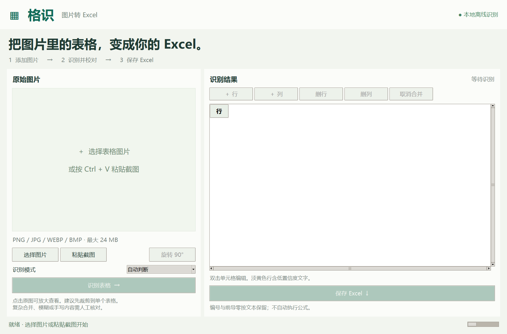

# 格识 · 图片转 Excel

Windows 本地 OCR 小工具：选择或粘贴一张表格图片，识别、校对后保存为 Excel。提供独立桌面版和可选的本地网页界面。



## 下载使用

在本仓库的 **Releases** 页面下载 Windows x64 便携版压缩包。

1. **完整解压**压缩包。
2. 双击 `格识.exe`。
3. 选择图片或粘贴截图，点击“识别表格”。
4. 双击单元格校对，然后点击“保存 Excel”。

无需安装 Python、Excel 或浏览器。模型随包携带，运行时可离线使用。分享时发送整个压缩包，保留同级 `_internal` 文件夹。

面向 Windows 10 / 11 64 位系统；目前完成了单台 Windows 电脑上的迁移目录测试，尚未做跨设备兼容性测试。程序未进行商业数字签名。

## 功能

- 中英文印刷体 OCR，支持 PNG、JPG、WEBP、BMP 等图片。
- 读取剪贴板截图、旋转图片、放大原图查看。
- 有边框表格还原行列和简单矩形合并区域。
- 无边框模式根据文字位置推断行列。
- 双击编辑单元格、增删行列、取消合并。
- 导出标准 `.xlsx`，保留前导零和长编号；以文本保存，不执行图片中的公式。

## 识别边界

一次处理一张图片、一个主要表格。建议先裁剪到表格范围，保持方向端正和文字清晰。

复杂合并、多表、倾斜拍照、模糊和手写内容可能识别错误；无边框表格可能错列。淡黄色行含低置信度文字，未标黄的文字同样需要校对。桌面预览按基本行列显示，合并区域在导出的 Excel 中还原。

单张上限 24 MB、2500 万像素；识别前最长边缩小到 2800 像素。不保证还原原图的字体、颜色和列宽。

## 数据与隐私

识别与导出都在本机进行，没有遥测或云端 OCR 接口。图片和识别结果不会自动保存；关闭软件前请导出。错误日志位于 `%LOCALAPPDATA%/GezhiOCR/desktop.log`，不会自动上传。

仓库中的演示表格使用合成数据。

## 从源码运行

使用 Windows x64 和 Python 3.13：

```powershell
py -3.13 -m venv .venv
.\.venv\Scripts\python.exe -m pip install -r requirements.txt
.\.venv\Scripts\python.exe desktop.py
```

可选本地网页版：

```powershell
.\.venv\Scripts\python.exe launch.py
```

网页仅监听 `127.0.0.1:18657`。停止网页后台服务：

```powershell
powershell -NoProfile -ExecutionPolicy Bypass -File .\stop.ps1
```

独立桌面版没有网页后台服务，关闭窗口即可退出。

## 测试与构建

```powershell
.\.venv\Scripts\python.exe -m pip install -r requirements-build.txt
.\.venv\Scripts\python.exe -X utf8 test_app.py
.\.venv\Scripts\python.exe -X utf8 build_portable.py
.\.venv\Scripts\python.exe -X utf8 package_and_test.py
.\.venv\Scripts\python.exe -X utf8 test_portable_window.py
```

`test_app.py` 生成合成中文示例图并检查 OCR、结构重建和导出。构建产物在 `dist/格识/`，发布 ZIP 在 `release/`。

便携版测试将 ZIP 解压到包含中文和空格的新目录，在测试进程移除 Python 环境变量并限制 PATH，通过冻结的 `.exe` 禁用网络连接后执行 OCR、单元格编辑与 Excel 导出，再回读验证文件。另行检查正常窗口启动和关闭。

测试依赖 Microsoft YaHei 字体。可选网页端测试需要本机 Microsoft Edge 和已运行的网页服务：`python test_browser.py`。

## 项目结构

| 文件 | 用途 |
| --- | --- |
| `desktop.py` | 独立桌面界面 |
| `ocr.py` | 本地 OCR、表格结构重建 |
| `excel.py` | 文本单元格 XLSX 导出 |
| `app.py`、`static/`、`templates/` | 可选网页界面 |
| `build_portable.py` | 打包运行环境、模型和第三方许可证 |

第三方组件包括 [RapidOCR](https://github.com/RapidAI/RapidOCR)、[OpenCV](https://github.com/opencv/opencv)、[ONNX Runtime](https://github.com/microsoft/onnxruntime)、[Pillow](https://github.com/python-pillow/Pillow)、Tcl/Tk 和 [PyInstaller](https://pyinstaller.org/)。相关许可证随便携包附在“开源许可”目录中。
